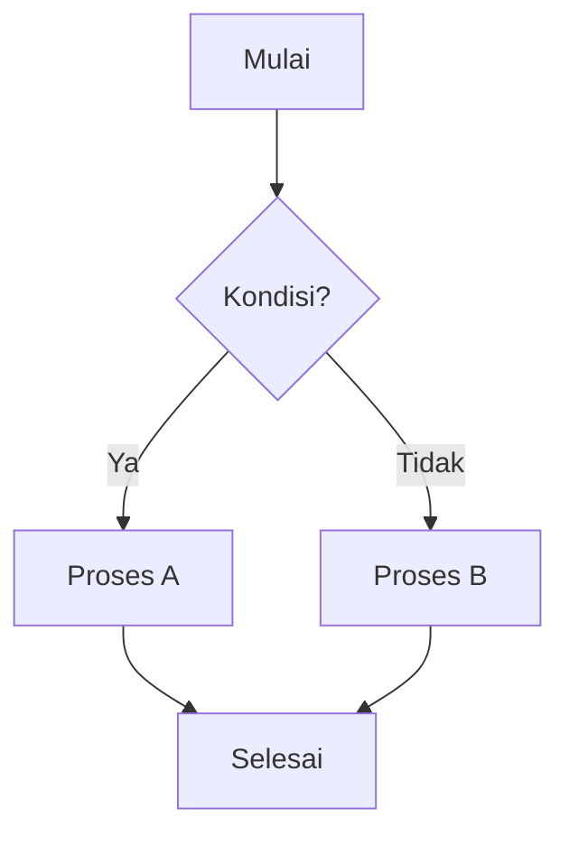

# 📚 Wiki.js - Panduan Lengkap Penggunaan

## 📖 Apa itu Wiki.js?

**Wiki.js** adalah aplikasi wiki modern, ringan, dan powerful yang dibangun dengan Node.js. Aplikasi ini memungkinkan Anda membuat dan mengelola dokumentasi, knowledge base, atau wiki internal untuk tim/organisasi Anda.

### 🎯 Kegunaan Utama

| Penggunaan | Deskripsi |
|------------|-----------|
| 📝 **Dokumentasi Perusahaan** | Membuat dokumentasi internal perusahaan |
| 📖 **Knowledge Base** | Pusat pengetahuan untuk tim/organisasi |
| 🎓 **Portal Pembelajaran** | Platform e-learning dan tutorial |
| 📋 **SOP & Prosedur** | Standar operasional prosedur |
| 🔧 **Dokumentasi Teknis** | API docs, technical guides |
| 📰 **Blog Internal** | Sharing artikel dan informasi |

### ✨ Fitur Utama

- ✅ Editor Markdown dengan preview real-time
- ✅ WYSIWYG Editor (What You See Is What You Get)
- ✅ Manajemen pengguna & grup dengan permission
- ✅ Autentikasi multi-metode (Local, OAuth, LDAP, dll)
- ✅ Pencarian full-text yang powerful
- ✅ Tema yang dapat dikustomisasi
- ✅ Multi-bahasa
- ✅ Upload dan manajemen aset/file
- ✅ Backup ke berbagai storage (Git, S3, dll)

---

## 🛠️ Persyaratan Sistem

### Minimum Requirements

| Komponen | Versi/Spesifikasi |
|----------|-------------------|
| **Node.js** | v18.17.1 atau lebih baru |
| **RAM** | Minimal 1 GB |
| **Storage** | Minimal 1 GB |
| **Database** | PostgreSQL 9.5+ / MySQL 8.0+ / SQLite 3.9+ |

### Database yang Didukung

```
┌─────────────────┬──────────────────────────────────────┐
│ Database        │ Keterangan                           │
├─────────────────┼──────────────────────────────────────┤
│ PostgreSQL      │ ⭐ Direkomendasikan (performa terbaik)│
│ MySQL/MariaDB   │ ✅ Didukung penuh                    │
│ MS SQL Server   │ ✅ Didukung                          │
│ SQLite          │ ✅ Untuk development/testing         │
└─────────────────┴──────────────────────────────────────┘
```

---

## 🚀 Instalasi Step-by-Step

### Metode 1: Instalasi Manual (Development)

#### Langkah 1: Clone Repository

```powershell
# Clone repository
git clone https://github.com/VibeCoding6-JC/wiki.git
cd wiki
```

#### Langkah 2: Install Dependencies

```powershell
# Pastikan menggunakan Node.js v18
node --version  # Harus menampilkan v18.x.x

# Install semua dependencies
yarn install

# Atau menggunakan npm
npm install
```

#### Langkah 3: Konfigurasi Database

```powershell
# Salin file konfigurasi contoh
copy config.sample.yml config.yml
```

Edit file `config.yml`:

```yaml
# Untuk SQLite (paling mudah untuk testing)
port: 3000

db:
  type: sqlite
  storage: ./data/wiki.sqlite

# ATAU untuk PostgreSQL (direkomendasikan untuk production)
db:
  type: postgres
  host: localhost
  port: 5432
  user: wikijs
  pass: password_anda
  db: wiki
  ssl: false
```

#### Langkah 4: Jalankan Aplikasi

```powershell
# Mode Development (dengan hot-reload)
yarn dev

# Mode Production
yarn build
yarn start
```

#### Langkah 5: Akses Wiki.js

Buka browser dan akses: **http://localhost:3000**

---

### Metode 2: Menggunakan Docker (Recommended for Production)

#### Docker Compose

Buat file `docker-compose.yml`:

```yaml
version: "3"
services:
  db:
    image: postgres:15-alpine
    environment:
      POSTGRES_DB: wiki
      POSTGRES_USER: wikijs
      POSTGRES_PASSWORD: wikijsrocks
    volumes:
      - db-data:/var/lib/postgresql/data
    restart: unless-stopped

  wiki:
    image: requarks/wiki:2
    depends_on:
      - db
    environment:
      DB_TYPE: postgres
      DB_HOST: db
      DB_PORT: 5432
      DB_USER: wikijs
      DB_PASS: wikijsrocks
      DB_NAME: wiki
    ports:
      - "3000:3000"
    restart: unless-stopped

volumes:
  db-data:
```

Jalankan:

```powershell
docker-compose up -d
```

---

## 📋 Skenario Penggunaan

### 🎬 Skenario 1: Setup Wiki untuk Tim Development

**Situasi**: Tim development membutuhkan tempat untuk menyimpan dokumentasi API, panduan coding, dan troubleshooting guide.

#### Step 1: First-Time Setup

1. Buka `http://localhost:3000`
2. Anda akan melihat **Setup Wizard**
3. Isi informasi:
   - **Administrator Email**: `admin@company.com`
   - **Administrator Password**: `SecurePassword123!`
   - **Site URL**: `http://wiki.company.com`

#### Step 2: Buat Struktur Halaman

```
📁 Development Wiki
├── 📄 Home (Halaman utama)
├── 📁 API Documentation
│   ├── 📄 REST API Guide
│   ├── 📄 GraphQL API
│   └── 📄 Authentication
├── 📁 Coding Standards
│   ├── 📄 JavaScript Style Guide
│   ├── 📄 Python Best Practices
│   └── 📄 Git Workflow
├── 📁 Troubleshooting
│   ├── 📄 Common Errors
│   └── 📄 FAQ
└── 📁 Onboarding
    ├── 📄 New Developer Guide
    └── 📄 Environment Setup
```

#### Step 3: Membuat Halaman Baru

1. Klik tombol **"+ New Page"** di sidebar
2. Pilih lokasi: `/api-docs/rest-api`
3. Pilih editor: **Markdown**
4. Tulis konten:

```markdown
# REST API Documentation

## Overview
API ini digunakan untuk mengakses data aplikasi.

## Base URL
```
https://api.company.com/v1
```

## Authentication
Semua request membutuhkan header:
```
Authorization: Bearer <token>
```

## Endpoints

### GET /users
Mengambil daftar semua users.

**Response:**
```json
{
  "users": [
    {"id": 1, "name": "John Doe"},
    {"id": 2, "name": "Jane Smith"}
  ]
}
```
```

5. Klik **"Create"** untuk menyimpan

---

### 🎬 Skenario 2: Knowledge Base untuk Customer Support

**Situasi**: Tim support membutuhkan knowledge base untuk menjawab pertanyaan pelanggan.

#### Step 1: Setup Grup & Permission

1. Masuk ke **Administration** → **Groups**
2. Buat grup baru:

| Grup | Deskripsi | Permission |
|------|-----------|------------|
| **Support Team** | Tim customer support | Read, Write, Delete |
| **Customers** | Pelanggan | Read only |
| **Editors** | Tim content | Read, Write |

3. Set permission untuk setiap grup:
   - Klik grup → **Permissions**
   - Atur akses per halaman/folder

#### Step 2: Struktur Knowledge Base

```
📁 Help Center
├── 📁 Getting Started
│   ├── 📄 Quick Start Guide
│   ├── 📄 Account Setup
│   └── 📄 First Steps
├── 📁 Features
│   ├── 📄 Feature A Guide
│   ├── 📄 Feature B Guide
│   └── 📄 Advanced Features
├── 📁 Troubleshooting
│   ├── 📄 Login Issues
│   ├── 📄 Payment Problems
│   └── 📄 Technical Errors
├── 📁 FAQ
│   ├── 📄 General FAQ
│   ├── 📄 Billing FAQ
│   └── 📄 Technical FAQ
└── 📁 Contact Us
    └── 📄 Support Channels
```

#### Step 3: Membuat Artikel FAQ

1. Buat halaman baru di `/faq/general`
2. Gunakan format yang mudah dibaca:

```markdown
# Frequently Asked Questions

## Akun & Login

### Bagaimana cara reset password?
1. Klik "Forgot Password" di halaman login
2. Masukkan email yang terdaftar
3. Cek inbox untuk link reset
4. Buat password baru

### Bagaimana cara mengubah email?
1. Login ke akun Anda
2. Buka Settings → Profile
3. Klik "Change Email"
4. Verifikasi email baru

---

## Pembayaran

### Metode pembayaran apa yang diterima?
Kami menerima:
- 💳 Kartu Kredit/Debit (Visa, Mastercard)
- 🏦 Transfer Bank
- 📱 E-Wallet (GoPay, OVO, Dana)

### Bagaimana cara melihat invoice?
1. Masuk ke Dashboard
2. Klik "Billing" → "Invoices"
3. Download PDF invoice yang diinginkan
```

---

### 🎬 Skenario 3: Dokumentasi SOP Perusahaan

**Situasi**: HR dan Operations membutuhkan tempat untuk SOP yang mudah diakses semua karyawan.

#### Step 1: Buat Struktur SOP

```
📁 Company SOP
├── 📁 HR Policies
│   ├── 📄 Employee Handbook
│   ├── 📄 Leave Policy
│   ├── 📄 Remote Work Policy
│   └── 📄 Code of Conduct
├── 📁 Operations
│   ├── 📄 Daily Procedures
│   ├── 📄 Emergency Protocols
│   └── 📄 Equipment Usage
├── 📁 IT Guidelines
│   ├── 📄 Security Policy
│   ├── 📄 Software Installation
│   └── 📄 VPN Setup
└── 📁 Finance
    ├── 📄 Expense Claims
    ├── 📄 Travel Reimbursement
    └── 📄 Procurement Process
```

#### Step 2: Template SOP

Buat halaman template yang konsisten:

```markdown
# [Nama SOP]

| Informasi | Detail |
|-----------|--------|
| **Nomor SOP** | SOP-HR-001 |
| **Versi** | 1.0 |
| **Tanggal Efektif** | 1 Januari 2025 |
| **Disetujui Oleh** | HR Manager |
| **Terakhir Diperbarui** | 5 Desember 2025 |

---

## 1. Tujuan
[Jelaskan tujuan SOP ini]

## 2. Ruang Lingkup
[Siapa yang terpengaruh oleh SOP ini]

## 3. Definisi
| Istilah | Definisi |
|---------|----------|
| Term 1 | Definition 1 |
| Term 2 | Definition 2 |

## 4. Prosedur

### 4.1 Langkah Pertama
1. Sub-langkah A
2. Sub-langkah B
3. Sub-langkah C

### 4.2 Langkah Kedua
1. Sub-langkah A
2. Sub-langkah B

## 5. Flowchart



## 6. Dokumen Terkait
- [Link ke dokumen 1]
- [Link ke dokumen 2]

## 7. Riwayat Revisi

| Versi | Tanggal | Perubahan | Oleh |
|-------|---------|-----------|------|
| 1.0 | 01/01/2025 | Initial release | Admin |
```

---

## 🔧 Administrasi Wiki.js

### Mengakses Panel Admin

1. Login sebagai administrator
2. Klik avatar di pojok kanan atas
3. Pilih **"Administration"**

### Menu Administrasi

```
📊 Administration Panel
├── 🏠 Dashboard          → Overview & statistics
├── 🌐 General            → Site settings, title, logo
├── 🌍 Locale             → Language settings
├── 🎨 Theme              → Appearance customization
├── 🔐 Groups             → User group management
├── 👥 Users              → User management
├── 📊 Analytics          → Page analytics
├── 🔑 Authentication     → Login methods
├── 💬 Comments           → Comment settings
├── 🔍 Search             → Search engine config
├── 💾 Storage            → Backup & sync settings
├── 📧 Mail               → Email configuration
├── 🔒 Security           → Security settings
└── ⚙️ System             → System info & utilities
```

### Mengelola Users

#### Membuat User Baru

1. **Administration** → **Users**
2. Klik **"+ Create User"**
3. Isi form:
   - Email: `user@company.com`
   - Name: `John Doe`
   - Password: `SecurePass123!`
   - Groups: Pilih grup yang sesuai
4. Klik **"Create"**

#### Mengatur Permission

1. **Administration** → **Groups**
2. Pilih grup → **Permissions**
3. Atur per path:

```
Path: /
Permission: Read ✅ Write ❌ Delete ❌

Path: /public/*
Permission: Read ✅ Write ✅ Delete ❌

Path: /admin/*
Permission: Read ✅ Write ✅ Delete ✅
```

---

## 📝 Tips Menulis Konten

### Markdown Cheat Sheet

```markdown
# Heading 1
## Heading 2
### Heading 3

**Bold text**
*Italic text*
~~Strikethrough~~

- Bullet list
- Item 2
  - Nested item

1. Numbered list
2. Item 2

[Link text](https://url.com)


> Blockquote

`inline code`

​```javascript
// Code block
const hello = "world";
​```

| Column 1 | Column 2 |
|----------|----------|
| Data 1   | Data 2   |
```

### Best Practices

1. **Gunakan heading yang jelas** - Bantu pembaca menavigasi
2. **Tambahkan gambar/diagram** - Visual membantu pemahaman
3. **Buat link internal** - Hubungkan halaman terkait
4. **Update secara berkala** - Pastikan konten tetap relevan
5. **Gunakan tag** - Kategorisasi untuk pencarian mudah

---

## 🔄 Backup & Maintenance

### Setup Git Backup

1. **Administration** → **Storage**
2. Aktifkan **Git**
3. Konfigurasi:
   ```yaml
   Repository URL: git@github.com:company/wiki-backup.git
   Branch: main
   Sync Interval: 5 minutes
   ```

### Scheduled Backup

Buat script backup otomatis:

```powershell
# backup-wiki.ps1
$backupDir = "C:\Backups\wiki"
$date = Get-Date -Format "yyyy-MM-dd"

# Backup database
pg_dump -U wikijs wiki > "$backupDir\wiki-$date.sql"

# Backup uploads
Copy-Item -Path ".\data\uploads" -Destination "$backupDir\uploads-$date" -Recurse
```

---

## ❓ Troubleshooting

### Error: Port 3000 Already in Use

```powershell
# Cari proses yang menggunakan port
netstat -ano | findstr :3000

# Kill proses tersebut
taskkill /PID <PID_NUMBER> /F
```

### Error: Database Connection Failed

1. Pastikan database service berjalan
2. Cek kredensial di `config.yml`
3. Cek firewall tidak memblokir port

### Error: Out of Memory

Tambahkan di `config.yml`:
```yaml
# Increase Node.js memory
pool:
  min: 2
  max: 10
```

---

## 📚 Resources

- 📖 [Dokumentasi Resmi](https://docs.requarks.io/)
- 💬 [Discord Community](https://discord.gg/rcxt9QS2jd)
- 🐛 [Report Issues](https://github.com/requarks/wiki/issues)
- 🎥 [Video Tutorials](https://www.youtube.com/results?search_query=wiki.js+tutorial)

---

## 📞 Butuh Bantuan?

Jika mengalami kesulitan:

1. Cek [FAQ](https://docs.requarks.io/faq) resmi
2. Cari di [GitHub Issues](https://github.com/requarks/wiki/issues)
3. Tanya di [Discord](https://discord.gg/rcxt9QS2jd)
4. Buat issue baru jika bug ditemukan

---

*Dokumentasi ini dibuat untuk membantu pengguna memahami dan menggunakan Wiki.js dengan mudah. Selamat mencoba! 🚀*
