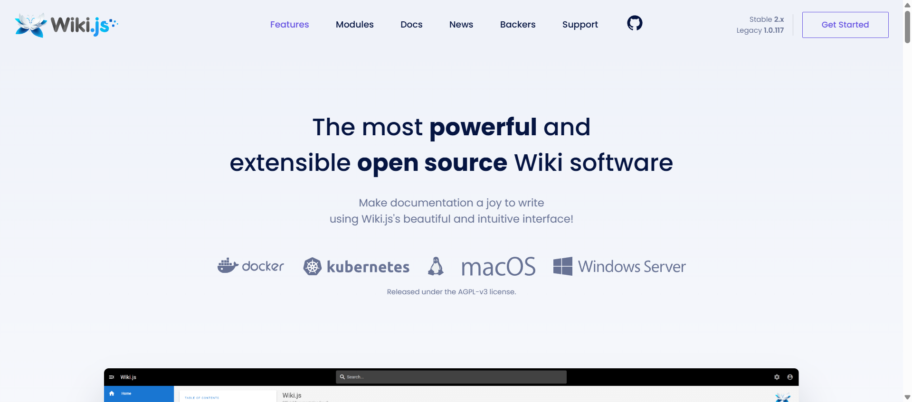
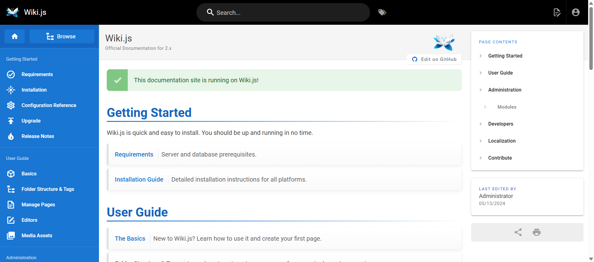
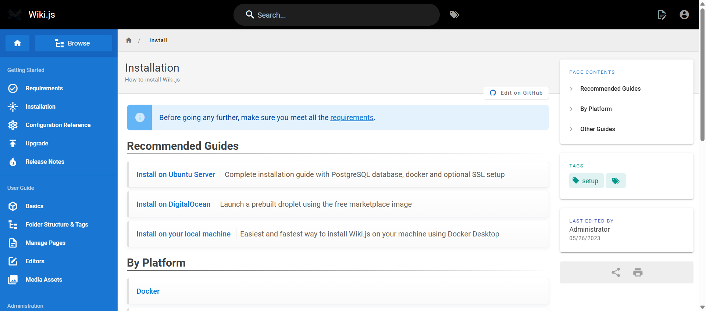
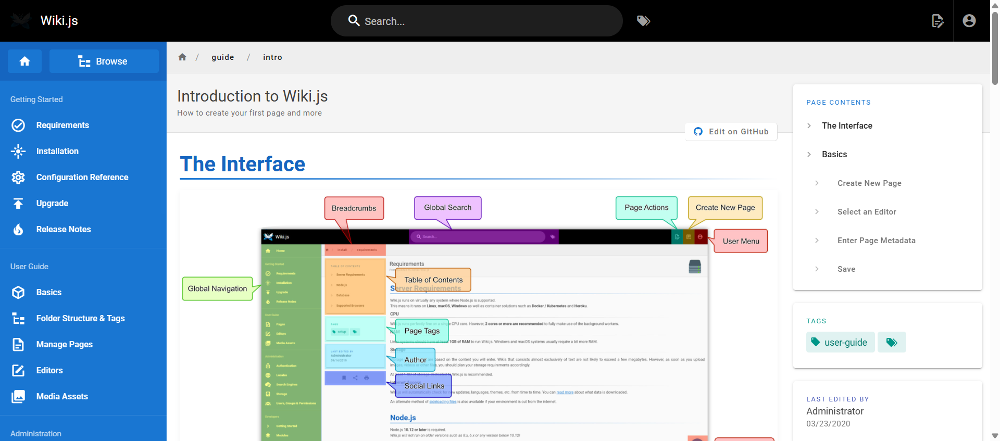
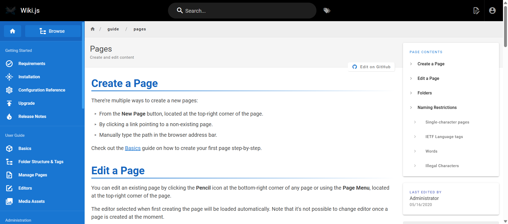
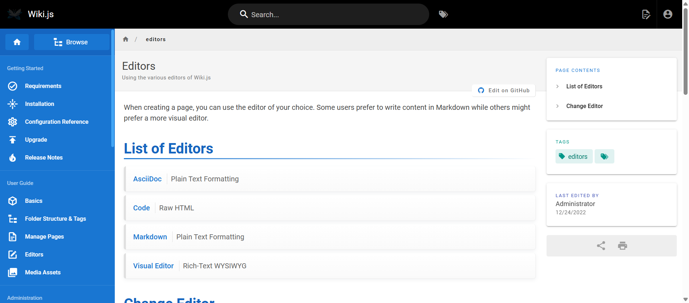
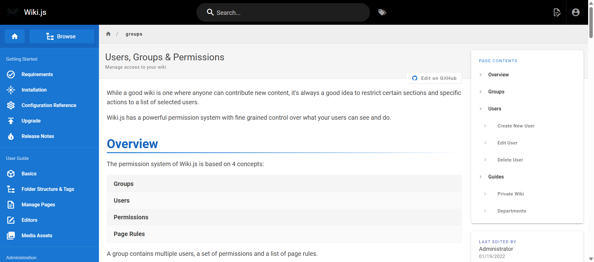
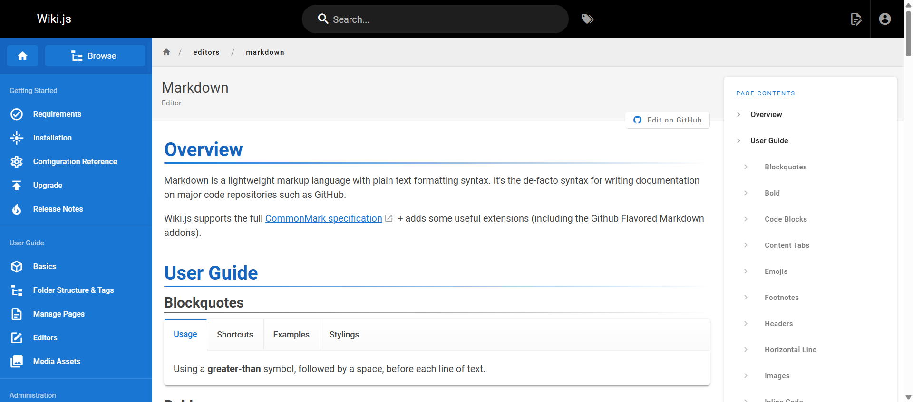

# 📘 User Manual - Wiki.js

## Panduan Pengguna Lengkap dengan Screenshot

---

## 📋 Daftar Isi

1. [Pengenalan Wiki.js](#1-pengenalan-wikijs)
2. [Halaman Utama](#2-halaman-utama)
3. [Dokumentasi & Navigasi](#3-dokumentasi--navigasi)
4. [Instalasi Wiki.js](#4-instalasi-wikijs)
5. [Dasar-Dasar Penggunaan](#5-dasar-dasar-penggunaan)
6. [Mengelola Halaman](#6-mengelola-halaman)
7. [Menggunakan Editor](#7-menggunakan-editor)
8. [Manajemen Pengguna & Grup](#8-manajemen-pengguna--grup)
9. [Editor Markdown](#9-editor-markdown)

---

## 1. Pengenalan Wiki.js

Wiki.js adalah platform wiki modern yang powerful dan mudah digunakan. Aplikasi ini cocok untuk:

- 📝 Dokumentasi tim/perusahaan
- 📖 Knowledge base
- 🎓 Portal pembelajaran
- 📋 SOP & prosedur

---

## 2. Halaman Utama

Ketika Anda mengakses website Wiki.js, Anda akan melihat halaman utama yang menampilkan fitur-fitur utama.



### Fitur yang Ditampilkan:

| Fitur | Keterangan |
|-------|------------|
| **Install anywhere** | Bisa dijalankan di berbagai platform |
| **Administration** | Panel admin yang lengkap |
| **Performance** | Performa tinggi dengan Node.js |
| **Customizable** | Tampilan bisa dikustomisasi |
| **Protected** | Pengaturan akses fleksibel |
| **Scalable** | Skalabilitas yang baik |

### Cara Mengakses:
1. Buka browser (Chrome, Firefox, Edge)
2. Ketik URL wiki Anda (contoh: `http://localhost:3000`)
3. Anda akan melihat halaman utama

---

## 3. Dokumentasi & Navigasi

Halaman dokumentasi menampilkan struktur navigasi yang rapi untuk memudahkan pencarian informasi.



### Struktur Navigasi:

```
📁 Dokumentasi
├── 🚀 Getting Started
│   ├── Requirements
│   ├── Installation
│   ├── Configuration
│   └── Upgrade
├── 📖 User Guide
│   ├── Basics
│   ├── Folder Structure
│   ├── Manage Pages
│   └── Editors
├── ⚙️ Administration
│   ├── Authentication
│   ├── Comments
│   ├── Locales
│   └── Users & Groups
└── 👨‍💻 Developers
    ├── Getting Started
    ├── Modules
    └── Themes
```

### Cara Navigasi:
1. **Sidebar kiri** - Menu navigasi utama
2. **Search bar** - Ketik kata kunci untuk mencari
3. **Breadcrumb** - Menunjukkan posisi halaman saat ini
4. **Table of Contents** - Daftar isi di sisi kanan

---

## 4. Instalasi Wiki.js

Panduan instalasi menjelaskan langkah-langkah untuk menginstall Wiki.js di berbagai platform.



### Metode Instalasi yang Tersedia:

| Metode | Keterangan | Rekomendasi |
|--------|------------|-------------|
| **Docker** | Container-based | ⭐ Production |
| **Linux** | Native installation | Development |
| **Windows** | Native installation | Development |
| **macOS** | Native installation | Development |
| **Kubernetes** | Orchestrated | Enterprise |

### Langkah Instalasi Cepat:

```powershell
# 1. Clone repository
git clone https://github.com/VibeCoding6-JC/wiki.git
cd wiki

# 2. Install dependencies
yarn install

# 3. Konfigurasi
copy config.sample.yml config.yml
# Edit config.yml sesuai kebutuhan

# 4. Jalankan
yarn dev
```

### Persyaratan Sistem:
- **Node.js**: v18.17.1+
- **Database**: PostgreSQL, MySQL, atau SQLite
- **RAM**: Minimal 1 GB
- **Storage**: Minimal 1 GB

---

## 5. Dasar-Dasar Penggunaan

Halaman ini menjelaskan konsep dasar penggunaan Wiki.js untuk pengguna baru.



### Konsep Utama:

#### 📄 Pages (Halaman)
- Setiap halaman memiliki **path** unik (contoh: `/docs/api/introduction`)
- Halaman bisa menggunakan berbagai **editor** (Markdown, WYSIWYG, dll)
- Setiap halaman memiliki **metadata** (judul, deskripsi, tags)

#### 📁 Folder Structure
- Halaman diorganisir dalam struktur folder virtual
- Path menentukan lokasi halaman (contoh: `/marketing/campaigns/2025`)
- Tidak ada batasan kedalaman folder

#### 🏷️ Tags
- Gunakan tags untuk kategorisasi konten
- Memudahkan pencarian dan filtering
- Satu halaman bisa memiliki multiple tags

### Cara Memulai:
1. Login ke Wiki.js
2. Klik tombol **"+ New Page"**
3. Pilih lokasi dan editor
4. Tulis konten Anda
5. Klik **"Create"** untuk menyimpan

---

## 6. Mengelola Halaman

Panduan lengkap untuk membuat, mengedit, dan mengelola halaman wiki.



### Operasi Halaman:

| Operasi | Cara | Shortcut |
|---------|------|----------|
| **Buat Baru** | Klik "+ New Page" | - |
| **Edit** | Klik "Edit" di halaman | `E` |
| **Hapus** | Page Actions → Delete | - |
| **Pindahkan** | Page Actions → Move | - |
| **Duplikasi** | Page Actions → Duplicate | - |

### Membuat Halaman Baru:

```
Step 1: Klik "+ New Page" di sidebar
         ↓
Step 2: Pilih lokasi halaman (path)
         Contoh: /docs/tutorial/getting-started
         ↓
Step 3: Pilih editor yang ingin digunakan
         - Markdown (direkomendasikan)
         - Visual Editor (WYSIWYG)
         ↓
Step 4: Tulis konten halaman
         ↓
Step 5: Isi metadata (judul, deskripsi, tags)
         ↓
Step 6: Klik "Create" untuk menyimpan
```

### Tips Mengelola Halaman:
- ✅ Gunakan path yang deskriptif dan konsisten
- ✅ Tambahkan tags untuk kategorisasi
- ✅ Isi deskripsi untuk SEO dan preview
- ✅ Gunakan internal links untuk menghubungkan halaman

---

## 7. Menggunakan Editor

Wiki.js menyediakan berbagai editor untuk membuat konten.



### Editor yang Tersedia:

| Editor | Deskripsi | Cocok Untuk |
|--------|-----------|-------------|
| **Markdown** | Editor berbasis teks dengan syntax markdown | Developer, Technical Writers |
| **Visual Editor** | WYSIWYG editor seperti Word | Non-technical users |
| **Code** | Editor untuk code dengan syntax highlighting | Developers |
| **API Docs** | Khusus untuk dokumentasi API | API Documentation |

### Perbandingan Editor:

```
┌─────────────────┬───────────────┬───────────────┬──────────────┐
│ Fitur           │ Markdown      │ Visual Editor │ Code         │
├─────────────────┼───────────────┼───────────────┼──────────────┤
│ Kemudahan       │ ⭐⭐⭐         │ ⭐⭐⭐⭐⭐       │ ⭐⭐          │
│ Fleksibilitas   │ ⭐⭐⭐⭐⭐       │ ⭐⭐⭐         │ ⭐⭐⭐⭐⭐      │
│ Preview         │ ✅ Real-time  │ ✅ Langsung   │ ❌           │
│ Code Blocks     │ ✅ Excellent  │ ⚠️ Basic     │ ✅ Excellent │
│ Tables          │ ✅ Ya         │ ✅ Ya         │ ✅ Ya        │
│ Images          │ ✅ Ya         │ ✅ Ya         │ ✅ Ya        │
└─────────────────┴───────────────┴───────────────┴──────────────┘
```

### Memilih Editor:
1. Saat membuat halaman baru, pilih editor yang sesuai
2. Editor **Markdown** adalah pilihan default dan paling fleksibel
3. Gunakan **Visual Editor** jika tidak familiar dengan Markdown

---

## 8. Manajemen Pengguna & Grup

Kelola akses pengguna melalui sistem grup dan permission.



### Konsep Permission:

```
┌─────────────────────────────────────────────────────────────┐
│                    PERMISSION HIERARCHY                      │
├─────────────────────────────────────────────────────────────┤
│                                                             │
│  👑 Administrators                                          │
│  └── Full access ke semua halaman dan settings              │
│                                                             │
│  👥 Groups                                                  │
│  └── Kumpulan users dengan permission yang sama             │
│                                                             │
│  👤 Users                                                   │
│  └── Anggota dari satu atau lebih groups                    │
│                                                             │
└─────────────────────────────────────────────────────────────┘
```

### Tipe Permission:

| Permission | Deskripsi |
|------------|-----------|
| **Read** | Melihat halaman |
| **Write** | Membuat dan mengedit halaman |
| **Delete** | Menghapus halaman |
| **Manage** | Mengatur permission halaman |
| **Asset** | Upload dan kelola aset/file |

### Cara Membuat Grup Baru:

```
1. Masuk ke Administration → Groups
2. Klik "+ Create Group"
3. Isi nama dan deskripsi grup
4. Atur permissions untuk grup
5. Tentukan path rules (halaman mana yang bisa diakses)
6. Klik "Save"
```

### Contoh Setup Permission:

| Grup | Path | Read | Write | Delete |
|------|------|:----:|:-----:|:------:|
| **Public** | /* | ✅ | ❌ | ❌ |
| **Editors** | /docs/* | ✅ | ✅ | ❌ |
| **Admins** | /* | ✅ | ✅ | ✅ |

---

## 9. Editor Markdown

Panduan lengkap menggunakan editor Markdown di Wiki.js.



### Tampilan Editor:

```
┌─────────────────────────────────────────────────────────────┐
│ TOOLBAR                                                     │
│ [Bold] [Italic] [Link] [Image] [Code] [Table] ...          │
├────────────────────────────┬────────────────────────────────┤
│                            │                                │
│  EDITOR AREA               │  PREVIEW AREA                  │
│                            │                                │
│  # Heading                 │  Heading                       │
│  **bold text**             │  bold text                     │
│  *italic*                  │  italic                        │
│                            │                                │
└────────────────────────────┴────────────────────────────────┘
```

### Markdown Cheat Sheet:

#### Headings
```markdown
# Heading 1
## Heading 2
### Heading 3
#### Heading 4
```

#### Text Formatting
```markdown
**Bold text**
*Italic text*
~~Strikethrough~~
`inline code`
```

#### Lists
```markdown
- Bullet item 1
- Bullet item 2
  - Nested item

1. Numbered item 1
2. Numbered item 2
```

#### Links & Images
```markdown
[Link text](https://url.com)

```

#### Code Blocks
````markdown
```javascript
const greeting = "Hello Wiki.js!";
console.log(greeting);
```
````

#### Tables
```markdown
| Column 1 | Column 2 | Column 3 |
|----------|----------|----------|
| Data 1   | Data 2   | Data 3   |
| Data 4   | Data 5   | Data 6   |
```

#### Blockquotes
```markdown
> This is a blockquote
> It can span multiple lines
```

### Tips Menggunakan Editor Markdown:

1. ✅ **Gunakan Preview** - Lihat hasil real-time di panel kanan
2. ✅ **Keyboard Shortcuts** - Ctrl+B untuk bold, Ctrl+I untuk italic
3. ✅ **Drag & Drop Images** - Upload gambar langsung ke editor
4. ✅ **Internal Links** - Link ke halaman lain dengan `[text](/path/to/page)`
5. ✅ **Code Syntax** - Tentukan bahasa untuk syntax highlighting

---

## 🎯 Skenario: Membuat Dokumentasi API

### Langkah-Langkah Lengkap:

#### Step 1: Buat Struktur Folder
```
/api-docs
├── /v1
│   ├── introduction
│   ├── authentication
│   ├── endpoints
│   │   ├── users
│   │   ├── products
│   │   └── orders
│   └── errors
└── /v2
    └── ... (struktur sama)
```

#### Step 2: Buat Halaman Introduction
1. Klik **"+ New Page"**
2. Path: `/api-docs/v1/introduction`
3. Pilih editor: **Markdown**
4. Tulis konten:

```markdown
# API Documentation v1

## Overview
Dokumentasi API untuk mengakses data aplikasi.

## Base URL
```
https://api.example.com/v1
```

## Authentication
Semua request membutuhkan API key:
```
Authorization: Bearer YOUR_API_KEY
```

## Rate Limits
- 100 requests per minute
- 10,000 requests per day
```

#### Step 3: Buat Halaman Endpoints
1. Buat halaman `/api-docs/v1/endpoints/users`
2. Dokumentasikan setiap endpoint:

```markdown
# Users API

## GET /users
Mengambil daftar semua users.

### Request
```http
GET /v1/users
Authorization: Bearer YOUR_API_KEY
```

### Response
```json
{
  "data": [
    {
      "id": 1,
      "name": "John Doe",
      "email": "john@example.com"
    }
  ],
  "meta": {
    "total": 100,
    "page": 1
  }
}
```
```

#### Step 4: Set Permission
1. Buka **Administration → Groups**
2. Buat grup "API Users"
3. Set permission: Read only untuk `/api-docs/*`

---

## 📞 Bantuan & Dukungan

Jika mengalami kesulitan:

| Resource | Link |
|----------|------|
| 📖 Dokumentasi Resmi | https://docs.requarks.io/ |
| 💬 Discord Community | https://discord.gg/rcxt9QS2jd |
| 🐛 Report Bug | https://github.com/requarks/wiki/issues |
| 💡 Feature Request | https://feedback.js.wiki/ |

---

## 📝 Catatan Penting

1. **Backup Rutin** - Selalu backup database secara berkala
2. **Update Berkala** - Perbarui Wiki.js untuk keamanan
3. **Permission** - Atur permission dengan hati-hati
4. **SSL** - Gunakan HTTPS untuk production

---

*Manual ini dibuat berdasarkan Wiki.js v2.x - Dokumentasi resmi tersedia di https://docs.requarks.io/*
